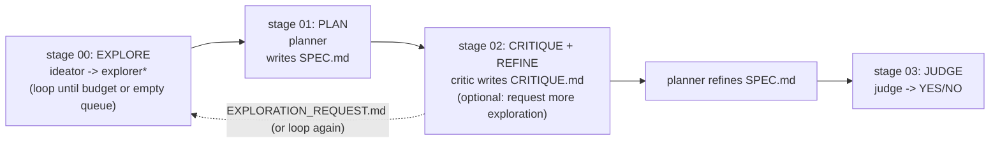

<div align="center">


# MomentMarkt

**The marketing department small merchants don't have, generated for the moment, redeemed through the rail the bank already operates.**

[](https://www.dsv-gruppe.de/)
[](https://hack-nation.ai)
[](./LICENSE)
[](./apps/mobile)
[](./apps/backend)

[**Demo video**](./assets/momentmarkt-demo.mp4) · [**Tech video**](./assets/momentmarkt-tech.mp4) · [**Submission**](./work/SUBMISSION.md) · [**Architecture**](./assets/architecture-slide.md) · [**Spec**](./work/SPEC.md) · [**Cover image**](./assets/cover.html)

</div>

---

# MomentMarkt

## What it is

Independent cafés, bakeries, and bookstores don't have a marketing department. MomentMarkt is the one they never had.

Two AI agents watch three live triggers — weather shifts, nearby events ending, demand gaps — and generate an offer for the right merchant at the right moment. The merchant approves it once and sets a rule; after that it runs itself. The wallet stays silent by default and only surfaces an offer when the conditions actually fit.

**Merchant demo:** [`https://momentmarkt.doruk.ch/`](https://momentmarkt.doruk.ch/) — the public merchant inbox.

**Backend API:** [`https://peaktwilight-momentmarkt-api.hf.space/`](https://peaktwilight-momentmarkt-api.hf.space/) — hit `/health`, `/signals/berlin`, or `/merchants/berlin?q=oberholz` directly.

Current implementation tracked in `work/SPEC.md`: Expo React Native consumer
app, small merchant web surface, FastAPI/fixtures as needed. Four-surface UX
framing (map / drawer / list / swipe stack) and the v1 → v2 roadmap are
captured in `context/UX_STRATEGY.md`. End-goal architecture (five-agent
topology, merchant portal, generative-offers-within-bounds wedge) is captured
in `context/END_GOAL_ARCHITECTURE.md`.

## Run The Mobile App

```bash
pnpm install
pnpm mobile:ios
```

The mobile app now uses a local Expo development client instead of Expo Go.
The first `pnpm mobile:ios` run compiles the native iOS app with Xcode and can
take several minutes; after that, hot reload works against the native dev
client. This is required for native modules such as Apple Maps via
`react-native-maps`.

Useful commands:

```bash
pnpm mobile:start
pnpm mobile:android
pnpm mobile:web
pnpm mobile:typecheck
```

The Expo app lives in `apps/mobile`. It is the canonical consumer demo surface;
the older untracked Next.js scaffold under `src/` is obsolete per `spec-v04`.

## Run The Merchant Inbox

```bash
pnpm merchant:dev
```

Useful commands:

```bash
pnpm merchant:typecheck
pnpm merchant:build
```

The merchant inbox lives in `apps/merchant`. It shows the Cafe Bondi Opportunity
Agent draft, auto-approved rain+demand rule, a second rule toggle, and aggregate
surfaced/accepted/redeemed/budget counters for the 20-30s merchant cut.

## Current Demo Spine

1. Mia opens MomentMarkt in Berlin Mitte; wallet stays silent.
2. Rain + Cafe Bondi demand gap triggers the Surfacing Agent.
3. A generated-looking React Native widget renders from JSON primitives.
4. The dev panel shows `{intent_token, h3_cell_r8}` and score/threshold reasons.
5. High-intent toggle lowers the threshold and changes the headline.
6. Mia redeems through a QR/token screen and simulated girocard cashback.
7. Merchant inbox shows the same offer auto-approved 3h earlier.

Architecture slide source lives in `assets/architecture-slide.md`.

## Submission Summary

**MomentMarkt** is a generative city wallet for the DSV-Gruppe **CITY WALLET**
track. Two cooperating agents — an **Opportunity Agent** that drafts offers
and GenUI widget specs from three live triggers (weather, events, demand) and
a **Surfacing Agent** that decides whether and how to surface an
already-approved offer in real time — power one neutral wallet UI. The
Surfacing Agent stays silent by default and is boosted by **high-intent**
signals (active screen time, map-app foreground, in-app coupon browsing); the
LLM is invoked at most once per agent output (one draft for Opportunity, one
headline rewrite per fired surface for Surfacing). Live demo runs on iOS
Simulator: Mia spine end-to-end, three structurally different GenUI widgets
for one merchant, on-screen `{intent_token, h3_cell_r8}` privacy boundary,
high-intent dev-panel toggle, simulated girocard checkout, merchant inbox
with the per-merchant demand-curve view, live `cities/berlin.json` ↔
`cities/zurich.json` config swap.

### Stack lineup

- **Consumer app**: React Native + Expo + TypeScript on iOS Simulator (`apps/mobile/`)
- **Merchant inbox**: small static React + Vite web app (`apps/merchant/`)
- **Backend**: FastAPI + SQLite (`apps/backend/`)
- **LLM**: Pydantic AI agents over provider-swappable model strings
- **Geo**: H3 resolution-8 coarse cells (~1 km) for the privacy boundary
- **Datasets**: Open-Meteo (live weather), OpenStreetMap via Overpass (937
  Berlin Mitte / 2096 Zürich HB POIs), VBB GTFS (403 stops within 1 km of
  Alexanderplatz), an events stub, and `data/transactions/berlin-density.json`
  for 4 demo merchants

Full implementation detail in `work/SPEC.md`; Devpost field drafts in
`work/SUBMISSION.md`; agent contract in `context/AGENT_IO.md`; tech-video
slide source in `assets/architecture-slide.md`.

### Honest demo / production swaps

Per the demo truth boundary in `CLAUDE.md`, the architecture slide draws three
"production swap" callouts in a consistent visual language:

| Capability | Demo (today) | Production (architectural roadmap) |
|---|---|---|
| **Surface path** | In-app card slides into the RN wallet on trigger fire | Opportunity Agent → push notification server (Expo Push / FCM / APNs) → device |
| **SLM extractor** | `extract_intent_token()` server-side stub returning a hand-coded enum | On-device Phi-3-mini / Gemma-2B; only the wrapper leaves the device |
| **Payone signal** | Hand-authored `data/transactions/berlin-density.json` (4 merchants) | Real Payone aggregation across Sparkassen — already flowing for any merchant on a Sparkassen terminal |

Other deliberate scope cuts kept out of the demo: no real Web Push, no live
on-device collection of high-intent signals (dev-panel toggle simulates), no
real-time image generation (pre-bucketed mood library keyed by `(trigger ×
category × weather)`), no real POS, no native iOS/Android build pipelines, no
Tavily, no Foursquare, no CH GTFS bind on the Zürich swap.

### Submission assets

- **Devpost field drafts** (Short Description + 6 structured fields per
  `context/HACKATHON.md`): `work/SUBMISSION.md`
- **Demo video** (≤55s on iOS Simulator): [`assets/momentmarkt-demo.mp4`](./assets/momentmarkt-demo.mp4)
- **Tech video** (≤55s; architecture slide → live editor → live phone): [`assets/momentmarkt-tech.mp4`](./assets/momentmarkt-tech.mp4)
- **16:9 cover image**: _path pending_ — concept locked in
  `work/SUBMISSION.md` under "Project cover image" (phone frame with
  rain-trigger GenUI widget on iOS Simulator chrome over a Berlin Mitte map
  fragment, monospace dev-panel chip top-right, neutral palette, no
  Sparkassen branding)
- **GitHub repo**: https://github.com/momentmarkt/momentmarkt (this repo)

## Run The Backend

```bash
pnpm backend:start
```

The FastAPI service lives in `apps/backend` and exposes:

- `GET /health`
- `GET /cities`
- `GET /signals/{city}`
- `POST /opportunity/generate`

It is fixture-first and demo-safe. Pass `{"use_llm": true}` to
`/opportunity/generate` or `/surfacing/evaluate` after configuring
`MOMENTMARKT_PYDANTIC_AI_MODEL` (for example `openai:gpt-5.2`) to try live
agent generation; failed LLM calls fall back to validated fixture JSON.

Validate with:

```bash
pnpm backend:test
```

## Planning Workflow

A file-driven multi-agent workflow for hackathon planning with a data-exploration
front stage. Designed to run via subagents (Claude Code's Task tool) with a
coordinator Claude Code instance as the dispatcher.

## Shape



## Files you fill in before first run

- `context/HACKATHON.md` — rules, tracks, judging criteria, sponsor stack, timeline
- `context/IDEA_SEED.md` — your raw pitch (keep it short; 5–10 min of freehand)
- `context/DATASET.md` — where the data lives, format, known docs, access notes

(Start from the `.template` files next to each.)

## How to run

Feed `ORCHESTRATOR.md` to your top-level Claude Code session. It dispatches
every stage by spawning subagents with the role files in `roles/` and the
stage files in `stages/`. It never does agent work itself — it only reads
artifacts from `work/` and routes.

See `examples/README.md` for invocation sketches.

## The invariant

Every role file starts with `OUTPUT:` specifying the single file that role
writes. Agents never output into the coordinator's context — only into their
assigned artifact. The coordinator reads artifacts, never agent stdout. This is
load-bearing; if you relax it, context pollution returns.
