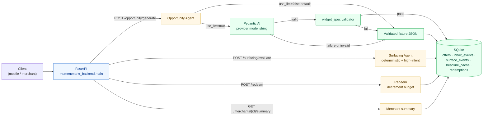

# MomentMarkt Backend

FastAPI service for the demo-safe backend path:

- Loads fixture signals from `data/weather`, `data/events`, and `data/transactions`.
- Produces Opportunity Agent drafts in the locked `context/AGENT_IO.md` shape:
  `{ "offer": {...}, "widget_spec": {...} }`.
- Validates generated widget specs before returning them.
- Persists drafted offers, inbox events, surfacing events, headline cache entries,
  and simulated redemptions to SQLite.
- Evaluates the Surfacing Agent with deterministic scoring, silence thresholds,
  high-intent boost, optional Azure AI Foundry semantic novelty downweighting,
  and top-1 selection.
- Falls back to deterministic known-good JSON when Pydantic AI or provider credentials are unavailable.

## Run

```bash
uv run --project apps/backend uvicorn momentmarkt_backend.main:app --reload
```

Open `http://127.0.0.1:8000/docs`.

Key endpoints:

- `POST /opportunity/generate` drafts and persists an Opportunity Agent offer.
- `POST /opportunity/batch` evaluates all city merchants and drafts only those with fired triggers.
- `POST /surfacing/evaluate` evaluates the top approved offer for a wrapped user context.
- `POST /redeem` records a simulated checkout and decrements merchant budget.
- `POST /offers/{id}/approve` and `/reject` update merchant review status.
- `GET /merchants/{merchant_id}/summary` returns offer counters and budget state.
- `GET /merchants/{merchant_id}/demand-chart` returns the typical/live curve and highlighted gap.
- `POST /demo/reset` and `/demo/seed` restore recording state.

City configuration is loaded from `cities/*.json` (`berlin.json`, `zurich.json`).

## Validate

```bash
uv run --project apps/backend --extra dev pytest
```

## Optional LLM Path

The endpoint is fixture-first by default. To try live generation through
Pydantic AI, install the optional extra and pass `use_llm: true`. The model
selector dispatches on `MOMENTMARKT_LLM_PROVIDER`:

### Azure OpenAI (production deployment uses this)

```bash
MOMENTMARKT_LLM_PROVIDER=azure \
MOMENTMARKT_LLM_MODEL=gpt-5.5 \
AZURE_OPENAI_ENDPOINT=https://<your-resource>.openai.azure.com/ \
AZURE_OPENAI_API_KEY=<key> \
uv run --project apps/backend --extra llm uvicorn momentmarkt_backend.main:app --reload
```

The deployed HF Space runs against the Azure `rapidata-hackathon-resource`
endpoint with `gpt-5.5`.

### OpenRouter

```bash
MOMENTMARKT_LLM_PROVIDER=openrouter \
MOMENTMARKT_LLM_MODEL=openai/gpt-5.2 \
OPENROUTER_API_KEY=<key> \
uv run --project apps/backend --extra llm uvicorn momentmarkt_backend.main:app --reload
```

### Direct provider string (no `MOMENTMARKT_LLM_PROVIDER`)

```bash
MOMENTMARKT_PYDANTIC_AI_MODEL=openai:gpt-5.2 \
uv run --project apps/backend --extra llm uvicorn momentmarkt_backend.main:app --reload
```

When `MOMENTMARKT_LLM_PROVIDER` is unset, Pydantic AI model strings need a
provider prefix, such as `openai:gpt-5.2`. Provider SDKs read their usual
environment variables. If anything fails, the service returns a validated
fallback and includes the fallback reason in `generation_log`.

Per the agent contract, high-intent signals are ignored by Opportunity
generation. Surfacing uses them later for thresholding and headline rewrites.
Set `use_llm: true` on `/surfacing/evaluate` to use the Pydantic AI headline
rewrite agent on cache misses.

## Optional semantic novelty

The Surfacing Agent can downweight offers that are semantically too similar to
recently surfaced offers for the same user. Local/dev default is neutral
`novelty=1.0`; production can enable Azure embeddings:

```bash
MOMENTMARKT_SEMANTIC_NOVELTY=azure
MOMENTMARKT_EMBEDDING_ENDPOINT=https://your-foundry-endpoint/embeddings
MOMENTMARKT_EMBEDDING_MODEL=text-embedding-3-small
MOMENTMARKT_EMBEDDING_API_KEY=...
```

If `MOMENTMARKT_EMBEDDING_ENDPOINT` is unset, the backend derives an Azure
OpenAI embeddings URL from `AZURE_OPENAI_ENDPOINT`,
`AZURE_OPENAI_EMBEDDING_DEPLOYMENT`, and `AZURE_OPENAI_API_VERSION`.
Provider failures are non-blocking and return neutral novelty so the demo stays
recordable.

## Request flow



Fixture-first is the demo-safe default; the live LLM path is opt-in and any failure (provider down, schema invalid) collapses back to validated fallback JSON, so the recording never breaks.
