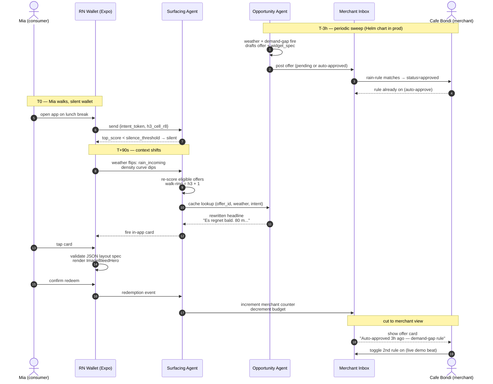
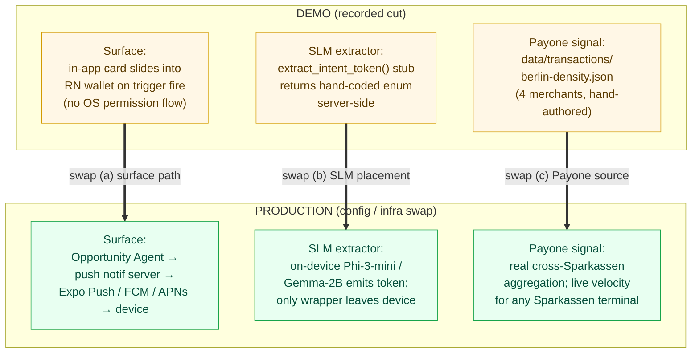
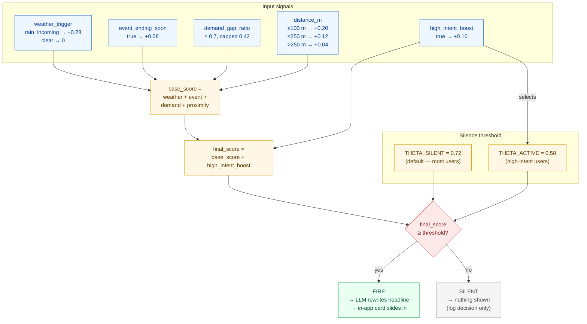

# MomentMarkt — Architecture Diagrams

> Mermaid diagrams rendering natively on GitHub. Companion to
> [`assets/architecture-slide.md`](./architecture-slide.md) (the slide source
> for the tech video). Aligned to `work/SPEC.md` (`spec-v04`).

---

## 1. System Overview

End-to-end flow from real signals through both agents to the RN wallet.
Privacy boundary `{intent_token, h3_cell_r8}` sits between the consumer
device and the server. The high-intent boost composes into the Surfacing
Agent's score.

```mermaid
flowchart LR
  subgraph SIG["SIGNALS (real today)"]
    direction TB
    WX["Open-Meteo<br/>weather"]
    OSM["OSM POIs<br/>937 BLN / 2096 ZRH"]
    GTFS["VBB GTFS<br/>walk-time"]
    DEN["berlin-density.json<br/>(sim Payone, 4 merch)"]
    EVT["Events stub<br/>(event-end)"]
  end

  OPP["OPPORTUNITY AGENT<br/>periodic job<br/>(Helm chart in prod)<br/>1 LLM call per draft<br/>emits offer + widget_spec"]

  INBOX["MERCHANT INBOX<br/>(Vite + React)<br/>Approve / Edit / Skip<br/>Auto-approve rules<br/>demand-curve view"]

  HI["HIGH-INTENT BOOST<br/>screen time<br/>map foreground<br/>coupon browse"]

  SURF["SURFACING AGENT<br/>real-time, deterministic<br/>walk-ring = h3 + 1<br/>silence threshold<br/>top-1 pick<br/>LLM rewrites HEADLINE on fire"]

  WALL["RN WALLET (Expo)<br/>in-app card slide<br/>GenUI widget<br/>6 RN primitives<br/>QR + sim girocard"]

  SIG --> OPP
  OPP -- "approved or auto-approved" --> INBOX
  INBOX --> SURF
  HI -. "lowers threshold<br/>aggressive copy" .-> SURF
  SURF == "{intent_token, h3_cell_r8}<br/>privacy boundary" ==> WALL

  classDef signal fill:#eef6ff,stroke:#3a7bd5,color:#0b3d91;
  classDef agent fill:#fff7e6,stroke:#d39a00,color:#5a3a00;
  classDef merchant fill:#f3e8ff,stroke:#7c3aed,color:#3b0764;
  classDef wallet fill:#e8fff1,stroke:#16a34a,color:#064e3b;
  classDef boost fill:#ffe8e8,stroke:#dc2626,color:#7f1d1d;

  class WX,OSM,GTFS,DEN,EVT signal;
  class OPP,SURF agent;
  class INBOX merchant;
  class WALL wallet;
  class HI boost;
```

**Legend:** blue = real signals · amber = agents (Opportunity periodic,
Surfacing real-time) · purple = merchant surface · green = consumer wallet ·
red dashed = high-intent boost · double-line edge = privacy wrapper crossing
device/server boundary.

---

## 2. Mia Demo Sequence

11-beat demo cut: Mia opens a silent wallet, weather + demand triggers fire,
the Surfacing Agent scores, an in-app card slides in, GenUI renders, redeem
flows through a simulated girocard, and the cut shows the merchant inbox
where the same offer was auto-approved 3h earlier under a rule.

---

## 3. Demo vs. Production (3 swap callouts)

Three lanes from the SPEC's "production swap" visual language: surface
mechanism, SLM placement, Payone integration. Demo column is what the
recorded cut shows; Prod column is what the architecture supports as a
config or infra swap, not a rewrite.

**Legend:** amber = demo state (mocked, recordable) · green = production
state (no architecture change required, only config / infra). The two-agent
loop, the GenUI JSON contract, and the `{intent_token, h3_cell_r8}` privacy
wrapper are identical across both columns.

---

## 4. GenUI Pipeline — LLM Output → React Native UI

How the Opportunity Agent's JSON layout spec becomes a live React Native
widget. The LLM emits a validated JSON tree; the schema coercer sanitises
it; the `WidgetRenderer` recurses over 6 primitives to produce real RN views.
If any step fails the fallback widget renders instead — demo is always safe.

```mermaid
flowchart LR
  LLM["LLM\n(Azure OpenAI gpt-5.5\nvia Pydantic AI)"]

  subgraph CONTRACT["widget_spec contract"]
    direction TB
    JSON["JSON tree\n{ type, children,\n  text, uri, action }"]
    SCHEMA["Schema validator\n(widgetSchema.ts)\ndepth ≤ 12\naction = 'redeem' only"]
    FALLBACK["Known-good fallback\nwidget if invalid"]
    JSON --> SCHEMA
    SCHEMA -- "valid" --> RENDER
    SCHEMA -- "invalid" --> FALLBACK
    FALLBACK --> RENDER
  end

  subgraph RENDER["WidgetRenderer (React Native)"]
    direction TB
    VIEW["View\n(container)"]
    SCROLL["ScrollView\n(scrollable)"]
    TEXT["Text\n(+ NativeWind class)"]
    IMG["Image\n(remote URI)"]
    PRESS["Pressable\n(action=redeem)"]
  end

  subgraph OUTPUT["Live UI on device"]
    RAIN["rainHero\n(image-bleed hero,\nrain mood)"]
    QUIET["quietStack\n(vertical stack,\nlow-demand)"]
    EVENT["preEventTicket\n(event frame)"]
  end

  LLM -- "emits" --> JSON
  RENDER --> OUTPUT

  classDef llm fill:#ffe8e8,stroke:#dc2626,color:#7f1d1d;
  classDef contract fill:#fff7e6,stroke:#d39a00,color:#5a3a00;
  classDef prim fill:#eef6ff,stroke:#3a7bd5,color:#0b3d91;
  classDef out fill:#e8fff1,stroke:#16a34a,color:#064e3b;

  class LLM llm;
  class JSON,SCHEMA,FALLBACK contract;
  class VIEW,SCROLL,TEXT,IMG,PRESS prim;
  class RAIN,QUIET,EVENT out;
```

**Key point for the demo:** The LLM never emits free-form JSX — it emits a
constrained JSON tree. The schema validator and fallback render mean the demo
is safe even if the LLM produces unexpected output.

---

## 5. Surfacing Score Breakdown

How the Surfacing Agent computes the final score and decides whether to fire.
All arithmetic is deterministic Python — no LLM involved at this stage.

**Demo values (Berlin, high-intent ON):**
`0.28 + 0.08 + 0.38 + 0.20 + 0.16 = 0.76` — fires against threshold `0.58`.
Toggle high-intent OFF: score drops to `0.60`, threshold rises to `0.72` → silent.

---

## See also

- [`assets/architecture-slide.md`](./architecture-slide.md) — slide source for the tech video
- [`work/SPEC.md`](../work/SPEC.md) — canonical spec (`spec-v04`)
- [`context/AGENT_IO.md`](../context/AGENT_IO.md) — agent I/O contract
