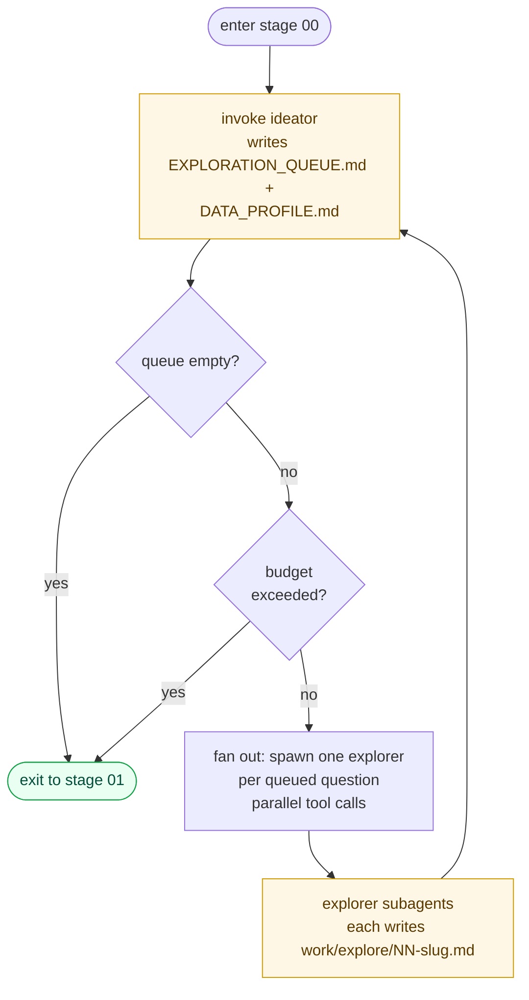

# Stage 00: EXPLORE

## Enter when

- `work/DATA_PROFILE.md` does not exist, OR
- `work/EXPLORATION_REQUEST.md` exists (re-entry from critic)

## Flow

```
while True:
    invoke ideator            # writes/updates EXPLORATION_QUEUE.md + DATA_PROFILE.md
    if QUEUE == "_empty_":
        break
    if budget_exceeded():
        break
    for each question in QUEUE (optionally in parallel):
        invoke explorer with that question   # writes work/explore/NN-<slug>.md
```



## Rules

- **Budget:** default is 3 full rounds (ideator → up to 5 explorers → ideator).
  Track in `work/BUDGET.md`. If exceeded, exit even with non-empty queue —
  over-exploration is a failure mode.
- **Parallelism:** explorer runs CAN be parallel since each writes to a unique
  `work/explore/NN-<slug>.md`. Sequential is safer for a first dry run; once
  you've confirmed each agent's output is clean, fan out by spawning multiple
  explorer subagents in the same message (parallel tool calls).
- **Orchestrator never synthesizes findings.** After each explorer run, re-invoke
  the ideator to synthesize into `DATA_PROFILE.md`. Do not try to merge reports yourself.
- **Re-entry from critic:** If `EXPLORATION_REQUEST.md` is present at entry,
  the ideator will see it and prioritize those questions. Do nothing special.

## Exit to

Stage 01 (plan) — unless re-entering from stage 02, in which case exit back
to stage 02 (refine) after one ideator pass completes.

## Invocation sketch (subagents)

Spawn an **ideator** subagent (writes EXPLORATION_QUEUE.md and DATA_PROFILE.md)
with this prompt:

```
Run the role defined in roles/ideator.md. Read that file first and follow
its instructions exactly.

Inputs (Read tool):
- context/HACKATHON.md
- context/IDEA_SEED.md
- context/DATASET.md
- work/explore/   (any existing reports)
- work/DATA_PROFILE.md   (previous version, if any)
- work/EXPLORATION_REQUEST.md   (if present — re-entry from critic)

Outputs (Write tool):
- work/EXPLORATION_QUEUE.md
- work/DATA_PROFILE.md

Stop after writing both files.
```

Then spawn one **explorer** subagent per queued question. Spawn all of them in
a single message (parallel tool calls); each prompt looks like:

```
Run the role defined in roles/explorer.md. Read that file first and follow
its instructions exactly. Use uv for any missing Python packages.

Inputs (Read tool):
- context/HACKATHON.md
- context/IDEA_SEED.md
- context/DATASET.md
- scripts/semantic_map.py

Question:
question_id: Q03
question_text: <paste the Q03 block from work/EXPLORATION_QUEUE.md verbatim>
output_path: work/explore/03-<slug>.md

Output (Write tool): work/explore/03-<slug>.md
```

(Repeat the prompt block for Q01, Q02, … each spawned as its own subagent in
the same parallel batch.)
